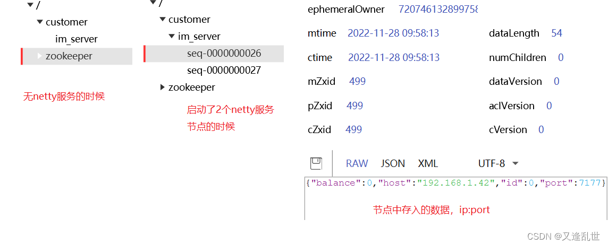

# 分布式Netty集群方案 加代码 SpringBoot 版
导读：本篇文章讲解 分布式Netty集群方案 加代码 SpringBoot 版，希望对大家有帮助，欢迎收藏，转发！站点地址：www.bmabk.com

目录

单机netty是怎么通信的？

多节点集群netty是怎么通信的呢？

netty集群是怎么搭建的呢？

连接上的 client 的 channelId 怎么存入 redis 中？

在集群模式中 客户端1向客户端2发送信息

演示效果

完整的讲解 netty 集群的搭建部署。从0讲解每一步，比如存入的数据是什么样的？多节点消息是怎么通信的？让没有搭建过的童鞋没有疑惑。例如：“唉，我存入redis中的实际是什么？我有没有写对？”

首先说下单机版 netty 的操作

普通的 springboot netty 项目，都是 springboot 项目启动加载完成后，启动netty 服务。代码如下

@Component
public class StartUpRunner implements ApplicationRunner {

    // 启动 netty 服务的代码
	@Override
	public void run(ApplicationArguments args) throws Exception {
		ServerBootstrap.bind(7177).sync();
	}
}
// netty pipeline，配置 websocket，访问路径是 socket.io
@Override
protected void initChannel(NioSocketChannel ch) throws Exception {
ChannelPipeline pipeline = ch.pipeline();
pipeline.addLast(new HttpServerCodec())
.addLast(new ChunkedWriteHandler())
.addLast(new HttpObjectAggregator(1024 * 1024))
.addLast(new WebSocketServerProtocolHandler("/socket.io", null, false, 1024 * 1024 * 50, false, true, 10000L));
}
然后前端页面访问 ws://localhost:7177/socket.io 进行通讯。

这样一个单机版本的就 netty 服务就起来了。

单机netty是怎么通信的？
client1 连接上 nettyServer，client2 同样连接上了 nettyServer。client1给client2发送信息，client1 查找ChannelGroup找到client2的 channel 信道把消息写入信道中，这样单机版的发送信息就完成了。

// 如果想让这个单机版的netty服务，集群部署呢？

首先我们把单机版的netty启动两份，把第一份的 tomcat 端口设置成 7111，netty 端口设置成 7177，第二份的 tomcat 端口设置成 7222，netty 端口设置成 7277，这样就启动了多节点集群服务。如果在多台服务器中，因为ip不同所以端口不用变动。

client1 连接上 nettyServer1。client2 连接上 nettyServer2。client1给client2发送信息，client1找client2的channel信道发送信息，client1发现它找不到client2的channel。那就不能发送信息啊，要怎么才能发送信息呢？

我们知道连接上netty服务的客户端 channel 都是存在本地的 自定义 map 或者 netty 提供的 ChannelGroup 里面。所以我的第一想法是 让连接上的客户端channel从存到本地，改成存到分布式缓存redis中，这样启动多个netty的时候，大家都是从redis中把对应客户端所属的channel拿下来发送消息。

实操之后发现这种方法思路是对的，但 channel 存入redis 没反应。不报错，redis 中也没有数据。

这里要说的知识点是 channel 是和机器绑定的，不能被序列化和反序列化，存入不了redis中，即使存进去了拿下来也是不能使用的。

多节点集群netty是怎么通信的呢？
channel 不能存到redis里面，但是 channel 的 id 是可以存到redis里面的，redis 中存入 client 的信息 key是用户id，value是channelId。

client1 连接上 nettyServer1。client2 连接上 nettyServer2。client1给client2发送信息，client1 拿client2的用户id，到redis上获取对应client2的 channelId，通过channelId查找本节点中的ChannelGroup，在本节点中找到了 client2 的channel，就可以发送信息了。在本节点中没有找到client2的 channel，就向 消息中间件mq 中广播 client2的channelId，所有nettyServer订阅此消息，nettyServer2收到了mq中的 channelId消息，然后nettyServer2拿着channelId查找ChannelGroup，它找到了channel，通过 channel 向 client2 发送了信息”你真棒”。这样就完成了集群netty的通信。

上面一直有提到集群，那么

netty集群是怎么搭建的呢？
这里介绍 3 种方式

1：zookeeper 注册中心

需要额外编码网关服务实现负载均衡

2：nginx

只需要配置nginx的负载均衡即可

3：nacos 注册中心

需要集成nacos注册中心和gateway网关

zookeeper 注册中心
zookeeper 的方式，是通过 zk 的临时编号节点EPHEMERAL_SEQUENTIAL。在netty服务启动的时候，创建 一个 zk 的临时编号节点，把 netty 服务的 ip 和 端口存入节点中。当 netty 服务停止后，zk 的心跳检测到来时会删除临时节点。zk教程传送门

当 zk 节点存在的时候，表示有nettyServer，需要编写代码获取zk节点下的nettyServer节点，当有client 请求进来时，拿到这些节点下 netty 的 ip和port，连接对应的 netty 服务。如果需要轮询/IP等负载均衡的话，需要自己实现相应的算法。

nginx
nginx 只需要配置负载均衡即可，nginx 本身就是一个强大的服务器，其他的不用我们考虑

nacos 注册中心
1：集成 nacos，在 netty 服务启动成功后，把 netty 服务注册到 nacos 中，代码如下：

@Component
public class StartUpRunner implements ApplicationRunner {

	@Autowired
	private NacosDiscoveryProperties nacosDiscoveryProperties;
	
    // 启动 netty 服务的代码
	@Override
	public void run(ApplicationArguments args) throws Exception {
		ServerBootstrap.bind(7177).sync();

		registerNamingService("netty-customer-server", "7177");
	}

	/**
	 * 注册到 nacos 服务中
	 * 
	 * @param nettyName netty服务名称
	 * @param nettyPort netty服务端口   
	 */
	private void registerNamingService(String nettyName, String nettyPort) {
		try {
			NamingService namingService = NamingFactory.createNamingService(nacosDiscoveryProperties.getServerAddr());
			InetAddress address = InetAddress.getLocalHost();
			namingService.registerInstance(nettyName, address.getHostAddress(), Integer.parseInt(nettyPort));
		} catch (Exception e) {
			throw new RuntimeException(e);
		}
	}
}
访问 nacos 控制台

2：集成 gateway 实现负载均衡，配置如下：

# 网关服务的端口号
server:
port: 7777

spring:
cloud:
nacos:
# 配置 nacos 服务地址
discovery:
server-addr: 127.0.0.1:8848
gateway:
routes:
- id: netty-customer-service
uri: lb://netty-customer-server
predicates:
- Path=/socket.io/**
discovery:
locator:
enabled: true
前端 websocket 访问地址：ws://127.0.0.1:7777/socket.io

负载均衡效果
当 client1 访问 网关，网关把 client1 路由到 nettyServer1 上，client2 访问 网关，网关把 client2 路由到 nettyServer2 上

连接上的 client 的 channelId 怎么存入 redis 中？
上面已经讲过存入逻辑了，这里直接贴代码了

	@Override
	protected void channelRead0(ChannelHandlerContext ctx, String msg) {
		// 把 string 转成 实体类型 TODO

		// 把 用户id:channelId 存入redis
		redisService.hSet("im_netty_channel_id", "userId", ctx.channel().id());
	}

	@Override
	public void exceptionCaught(ChannelHandlerContext ctx, Throwable cause) {
		log.error("{} 异常断开，异常信息 {}", ctx.channel(), cause.getMessage());
		ctx.channel().close();
		cause.printStackTrace();
	}

	/**
	 * channel 连接成功时 触发
	 */
	@Override
	public void channelActive(ChannelHandlerContext ctx) {
		channelGroup.add(ctx.channel());
	}

	/**
	 * channel 断开连接时 触发
	 */
	@Override
	public void channelInactive(ChannelHandlerContext ctx) {
		channelGroup.remove(ctx.channel());
	}

在集群模式中 客户端1向客户端2发送信息
向 mq 广播队列中发送信息

	@Override
	protected void channelRead0(ChannelHandlerContext ctx, String msg) {
		
		// 从 redis 中获取 client2 的 channelId
		Object channelId = redisService.hGet("im_netty_channel_id", "收件人用户id");
		// 根据 channelId 从 channelGroup 中查找 channel
		Channel toChannel = channelGroup.find((ChannelId) channelId);
		if (null != toChannel) {
			// 找到了 channel 发送信息
			toChannel.writeAndFlush(new TextWebSocketFrame("你真棒"));
		} else {
			// 没有找到 channel，向 mq 广播队列中发送消息
			rabbitmqImService.sendMessageMQ(channelId);
		}

	}
mq 的广播队列，监听消息

	@RabbitHandler
	@RabbitListener
	public void messageHandle(Object channelId) {
		try {
			Channel toChannel = channelGroup.find((ChannelId) channelId);
			if (null != toChannel) {
				System.err.println(" toChannel 有值");
				toChannel.writeAndFlush(new TextWebSocketFrame("你真棒"));
			}
		} catch (Exception e) {
			throw new RuntimeException("消费失败 {}", e);
		}
	}
演示效果
启动 网关服务，启动 2 个 netty 节点

client1 连接上 nettyServer1 ，client2 连接上 nettyServer2

client1 向 client2 发送信息

nettyServer1 没有找到 client2 的信道，向 mq 中广播信息

广播节点收到信息，在 nettyServer2 中找到channel，向channel中发送信息

client2 收到信息

代码传送门  netty集群